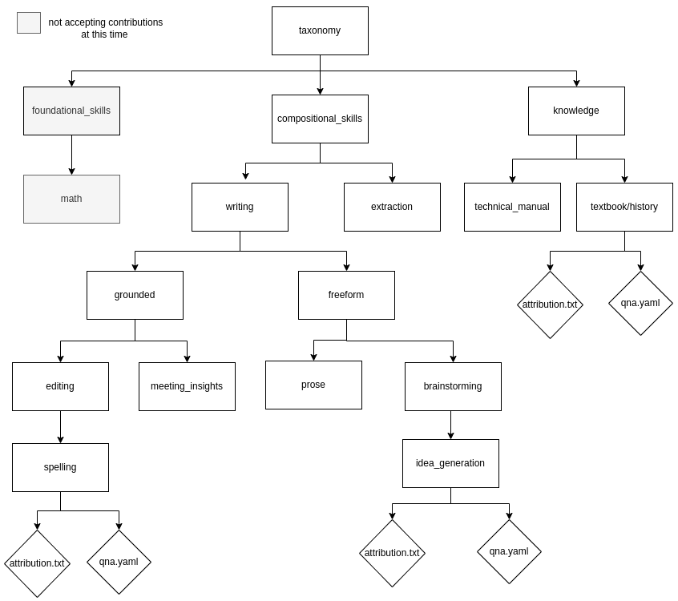

## WIP

## Hackathon: Usando InstructLab para resolver problemas reais

**Bem-vindo!**

Este hackathon desafia você a aproveitar o poder do InstructLab para desenvolver soluções inovadoras utilizando LLMs, como o [granite](https://huggingface.co/ibm-granite) ou o [Llama](https://huggingface.co/meta-llama). Com certeza você já utilizou o [ChatGPT](https://chatgpt.com/) para tirar dúvidas ou gerar conteúdo, mas como nem tudo é perfeito, algumas das respostas podem não estar corretas ou o conteúdo gerado pode não estar em um padrão que você gostaria.

Os dados utilizados no treinamento das LLMs são em sua grande maioria dados públicos, como esses modelos poderão responder perguntas se não foram treinados com os dados, normalmente confidenciais, da sua empresa? Essa é uma das respostas que o InstructLab veio para responder.

**O que é InstructLab?**

O InstructLab é uma plataforma que permite adicionar skills (habilidades) e knowledge (conhecimentos) nas LLMs de um modo extremamente simples. 
Podemos, por exemplo, ensinar uma LLM a criar publicações para o linkedin ou e-mails coorporativos seguindo os padrões da sua organização.

**Exemplos de skill e knowledge**
- Skill:
  - Como ignorar informações pessoais em resumos
  - Organizar listas com base na lista fornecida e no método instruído de organização.
  - Escrever emails formais ou informais.
  - Outros exemplos: [foundational skills](https://github.com/instructlab/taxonomy/tree/main/foundational_skills) e [compositional skills](https://github.com/instructlab/taxonomy/tree/main/compositional_skills)
- Knowledge:
  - [História da IBM](https://github.com/instructlab/taxonomy/tree/main/knowledge/textbook/history/ibm_history)
  - FAQ sobre empréstimo do banco X
  - Horóscopo

**O que é Taxonomia**

A taxonomia assume um papel crucial na organização e categorização de instruções e materiais de aprendizagem. Através da criação de um sistema de classificação bem estruturado, o InstructLab permite que os usuários naveguem facilmente por um vasto acervo de informações, encontrando rapidamente o que procuram.

A taxonomia do InstructLab é composta por diferentes níveis de categorias, desde as mais gerais até as mais específicas. Cada nível representa um grupo de itens relacionados entre si, criando uma hierarquia que facilita a compreensão da estrutura geral do conteúdo.

**Links Úteis**

* Site do InstructLab: [https://instructlab.ai/](https://instructlab.ai/)
* Documentação do InstructLab: [https://github.com/instructlab](https://github.com/instructlab)
* Exemplos de Projetos InstructLab: TODO (Pesquise por exemplos de projetos InstructLab no site do InstructLab ou em um mecanismo de busca geral)

**Desafio do Hackathon**

Sua equipe terá a tarefa de desenvolver um projeto InstructLab que aborde um desafio específico enfrentado pelo SENAI. Este desafio pode estar relacionado a:

* Um programa de treinamento específico
* Uma habilidade ou competência específica
* Uma necessidade geral de melhores resultados de aprendizagem

**Aqui estão alguns passos para você começar:**

1. **Forme uma Equipe:** Colabore com outros participantes para formar uma equipe com habilidades complementares.
2. **Identifique um Desafio:** Pesquise os programas e materiais de treinamento do SENAI para identificar um desafio específico que você gostaria de abordar.
3. **Desenvolva sua Solução:** Use o InstructLab para criar uma experiência de aprendizagem interativa que lide com o desafio escolhido.
4. **Refine e Apresente:** Aprimore seu projeto e prepare uma apresentação clara e concisa para os jurados.

**Critérios de Julgamento**

* Criatividade e Inovação: A originalidade de sua abordagem para resolver o desafio escolhido.
* Uso de Recursos do InstructLab: A eficácia do seu projeto em utilizar as funcionalidades do InstructLab.
* Impacto Potencial: O potencial da sua solução para causar um impacto positivo nos programas de treinamento do SENAI.
* Clareza e Apresentação: A clareza e eficácia da sua apresentação na comunicação do seu projeto.

**Mais detalhes**

[SKILL](https://github.com/instructlab/taxonomy/blob/main/docs/SKILLS_GUIDE.md)
[KNOWLEDGE](https://github.com/instructlab/taxonomy/blob/main/docs/KNOWLEDGE_GUIDE.md)
